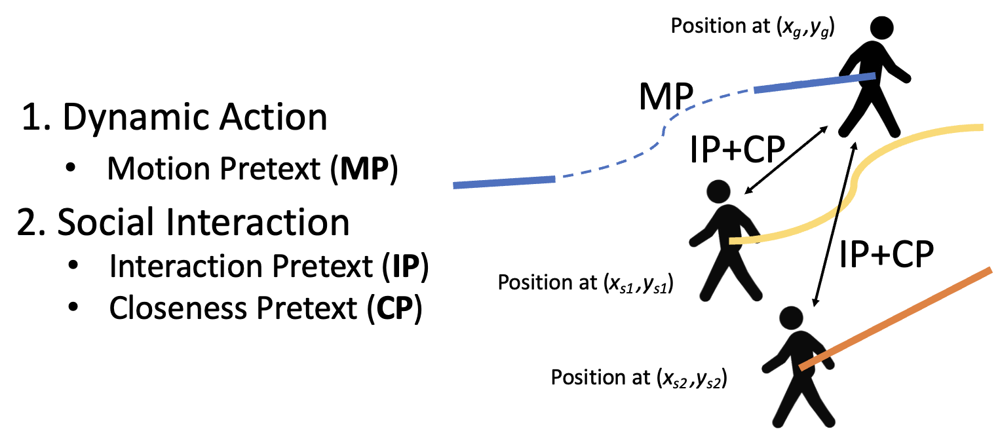
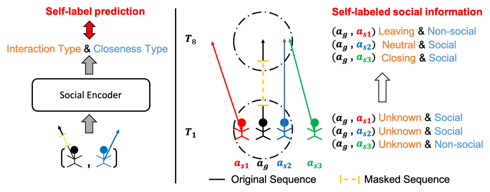
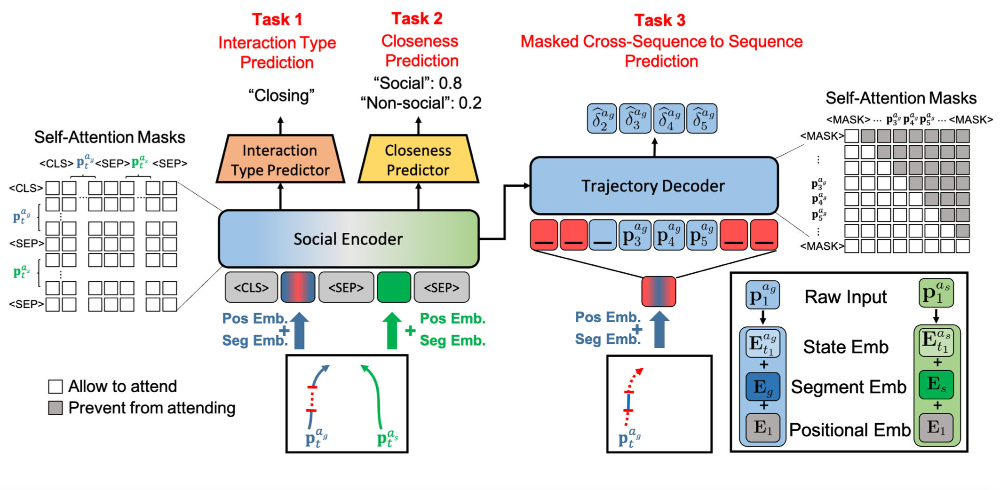
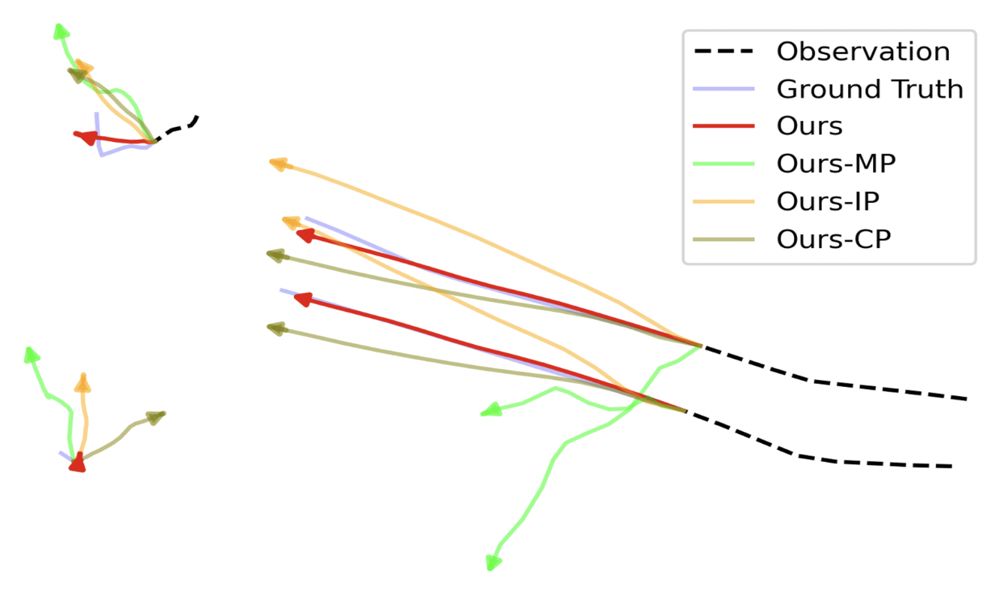

# Social-SSL
This is the official implementation of our paper:

Social-SSL: Self-Supervised Cross-Sequence Representation Learning Based on Transformers for Multi-Agent Trajectory Prediction\
[Paper(PDF)](https://www.ecva.net/papers/eccv_2022/papers_ECCV/papers/136820227.pdf)\
[Supplementary Materials(PDF)](https://www.ecva.net/papers/eccv_2022/papers_ECCV/papers/136820227-supp.pdf)\
Li-Wu Tsao, Yan-Kai Wang, Hao-Siang Lin, Hong-Han Shuai, Lai-Kuan Wong, Wen-Huang Cheng





# Environment
- Tested OS: Linux Ubuntu 18.04

- Create a virtual environment (The packages we need are included in the initial conda environment)\
`$conda create -n SocialSSL python=3.6`

- Install a gpu-version for pytorch (PyTorch==1.7.0): https://pytorch.org/

- Install tqdm\
`$pip install tqdm`

# Preprocessing & Datasets
The preprocessed version of ETH/UCY dataset can be download [here](https://drive.google.com/drive/folders/1lz34zED9gC2-m17FmajLotJjtw0EKkB9?usp=sharing).

More details on preprocessing and the tools for converting from raw datasets <br> to our version can be found in the [utils/dataset_convertor/](utils/dataset_convertor) folder.

# Training pretext

`$python train_pretext.py`

# Finetune on downstream (Trajectory Prediction)
Please check the details in our paper, which is also noticed by an [issue](https://github.com/Sigta678/Social-SSL/issues/3)\
`$python finetune.py`

# Evaluation
`$python eval.py`

# Qualitative Result


# Citation
If you find our work is relevant to your research, please cite:
```
@inproceedings{tsao2022social,
  title={Social-SSL: Self-supervised Cross-Sequence Representation Learning Based on Transformers for Multi-agent Trajectory Prediction},
  author={Tsao, Li-Wu and Wang, Yan-Kai and Lin, Hao-Siang and Shuai, Hong-Han and Wong, Lai-Kuan and Cheng, Wen-Huang},
  booktitle={European Conference on Computer Vision},
  pages={234--250},
  year={2022},
  organization={Springer}
}
```
